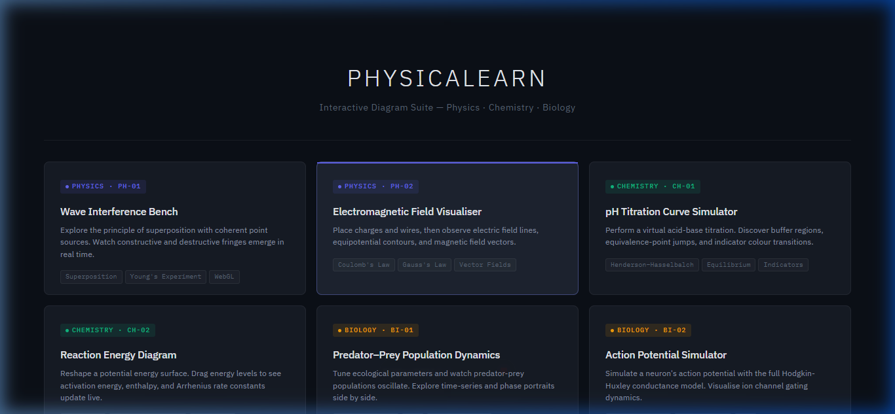
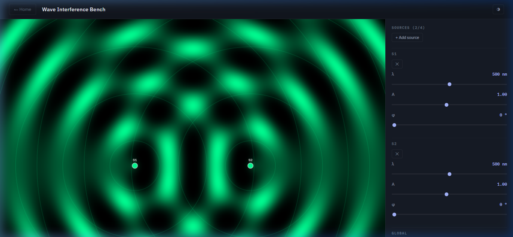
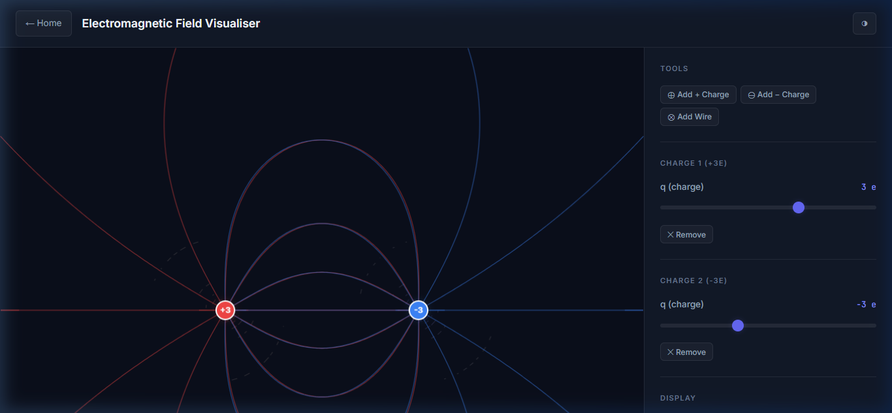
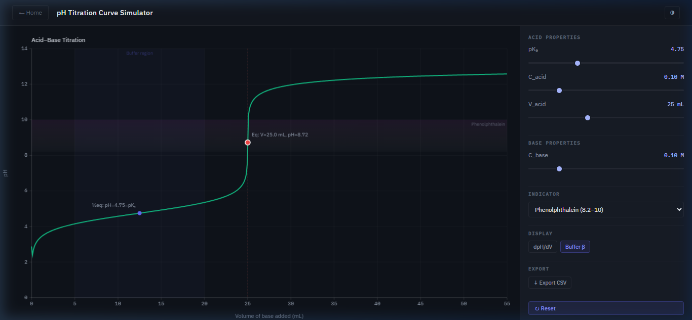
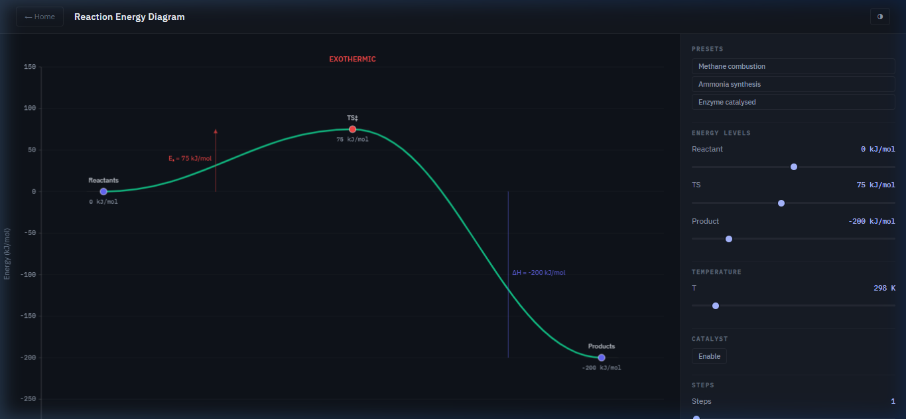
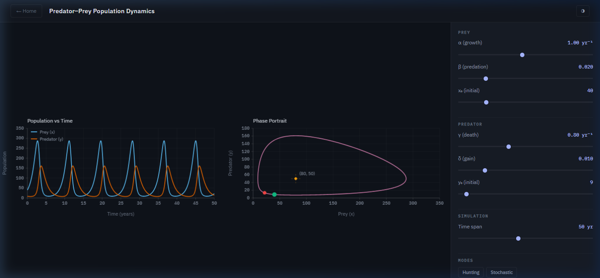
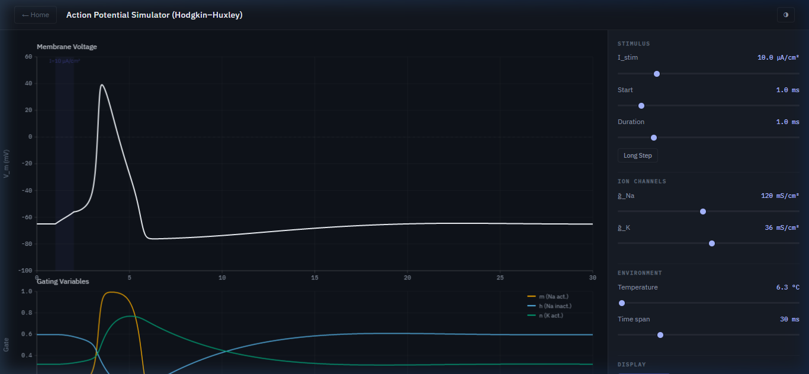

# 🔬 PhysicaLearn — Interactive Diagram Suite



PhysicaLearn is a suite of **high-fidelity, interactive science diagrams** covering Physics, Chemistry, and Biology. Built from the ground up for educational use, every diagram generates visuals in real-time by solving the underlying mathematical and physical equations.

---

## 🚀 Features & Architecture

*   **Zero Dependencies (Vanilla JS):** No heavy frameworks. Pure JavaScript, HTML, and CSS engineered for performance.
*   **Real-Time Math Engine:** Uses a custom 4th-order Runge-Kutta (RK4) integrator for solving ordinary differential equations (ODEs).
*   **Scientific UI Design:** A custom design system built with CSS variables featuring IBM Plex typography, Okabe-Ito color-blind safe palettes, and clean, publication-ready graph axes.
*   **Accessibility First:** Keyboard-navigable controls, ARIA labels, and high-contrast modes.

## 🛠️ Installation & Setup

To run the suite locally, clone the repository and start the Vite dev server:

```bash
git clone https://github.com/muhammaduzair11/PhysicsLearn.git
cd PhysicsLearn
npm install
npm run dev
```

The application will be available at `http://localhost:5173/`.

---

## 📊 The Diagrams

### Physics
<details>
<summary><strong>👉 PH-01 · Wave Interference Bench</strong></summary>

Dynamically calculates the superposition of up to 4 coherent point sources, rendering a pixel-perfect intensity heatmap.

</details>

<details>
<summary><strong>👉 PH-02 · Electromagnetic Field Visualiser</strong></summary>

Computes Coulomb field lines, magnetic field vectors (Biot-Savart), and equipotential contours. Drag and drop charges to see the field update instantly.

</details>

### Chemistry
<details>
<summary><strong>👉 CH-01 · pH Titration Curve Simulator</strong></summary>

Solves the Henderson-Hasselbalch equation dynamically. Features auto-annotated equivalence points, a derivative (dpH/dV) overlay, and color bands for 6 different indicators.

</details>

<details>
<summary><strong>👉 CH-02 · Reaction Energy Diagram</strong></summary>

A draggable Bézier potential energy surface. Modify reactants, transitions states, and products to see real-time changes to the Arrhenius rate constants ($k$) and Equilibrium constants ($K_{eq}$).

</details>

### Biology
<details>
<summary><strong>👉 BI-01 · Predator-Prey Population Dynamics</strong></summary>

Integrates the Lotka-Volterra equations using the RK4 engine. Features a dual-canvas layout displaying both a time-series graph and a phase portrait side-by-side.

</details>

<details>
<summary><strong>👉 BI-02 · Action Potential Simulator (Hodgkin-Huxley)</strong></summary>

A comprehensive simulation of the 1952 Hodgkin-Huxley conductance model. Plots membrane voltage alongside ion channel gating variables (m, h, n) with accurate Q₁₀ temperature correction.

</details>

---

## 👨‍💻 Contributing
Feel free to open issues or submit pull requests. Ensure any new interactive diagram modules tap into the shared `graph.js` engine and `rk4.js` solver to maintain UI consistency and scientific rigor.
